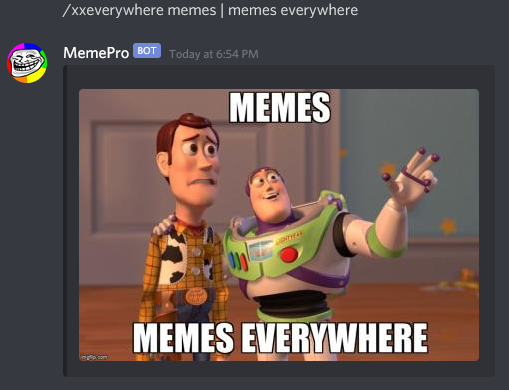
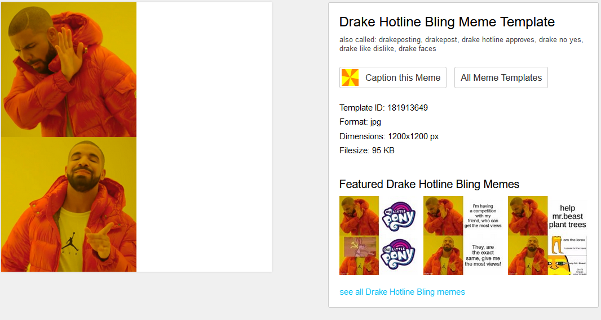

## Welcome to MemePro

The latest and greatest meme creation discord bot.

### Overview

This bot allows users to caption memes through custom defined commands. Popular memes have commands predefined for ease of use.

### Predefined Meme Commands

Here is a list of the memes that currently have predefined commands.

- `/spongebob`: https://imgflip.com/memetemplate/Mocking-Spongebob
- `/changemymind`: https://imgflip.com/memetemplate/Change-My-Mind
- `/twobuttons`: https://imgflip.com/memetemplate/Two-Buttons
- `/hotlinebling`: https://imgflip.com/memetemplate/Drake-Hotline-Bling
- `/onedoesnotsimply`: https://imgflip.com/memetemplate/One-Does-Not-Simply
- `/xxeverywhere`: https://imgflip.com/memetemplate/13026863/TOYSTORY-EVERYWHERE
- `/cheers`: https://imgflip.com/memetemplate/10933812/wolf-of-wall-street
- `/doge`: https://imgflip.com/memetemplate/Doge
- `/grusplan`: https://imgflip.com/memetemplate/Grus-Plan
- `/headout`: https://imgflip.com/memetemplate/196656673/Imma-head-Out

### Usage

`/aboutmemepro`

Displays the welcome page.

`/addmeme {command:required} {templateId:required}`

Creates a new meme command or overwrites an existing meme command with the imgflip template id provided.

`/removememe {command:required}`

Removes an existing meme command.

`/{command:required} {text0} | {text1}`

Displays the corresponding captioned meme with the `text0` and `text1` captions. `text0` and `text1` are usually either the top/bottom or left/right captions respectively.

### FAQs
- I want to `/addmeme`. How do I find the template id of the meme?

Go [here](https://imgflip.com/memetemplates) to browse the selection of meme templates (you can even create your own!). Click the template that you want to add, and click "Blank Template". This will bring you to the page where the Template ID is displayed. You can also browse a list of the top 100 memes and their template ids [here](https://imgflip.com/popular_meme_ids).

- Are custom meme commands unique to a server?

Yes, when you `/addmeme`, the meme command you choose is only specific to that server.

- Can I overwrite the predefined meme commands?

No, not as of right now.

- Can I have multiple meme commands that point to the same meme template id?

Yes, because why not :)

- Why did you make this?

Memes.

### Source Code
The source code is free and openly avaliable [here]().

### Credits
Developed by [William Zhang](https://github.com/WilliamHYZhang) in Node.js with the Repl.it, Discord, and Imgflip APIs.
